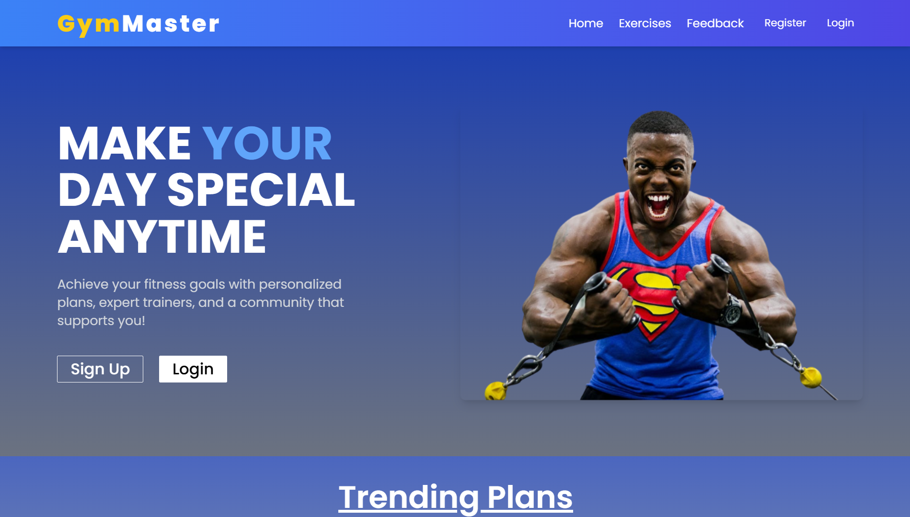
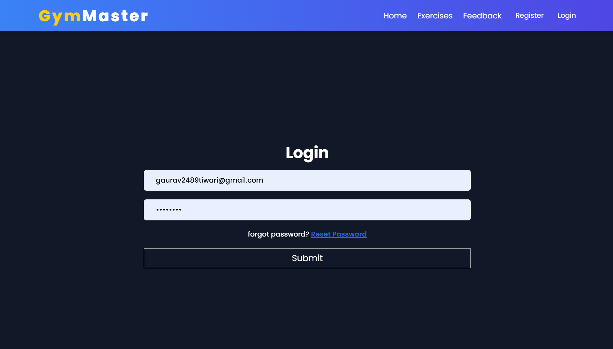
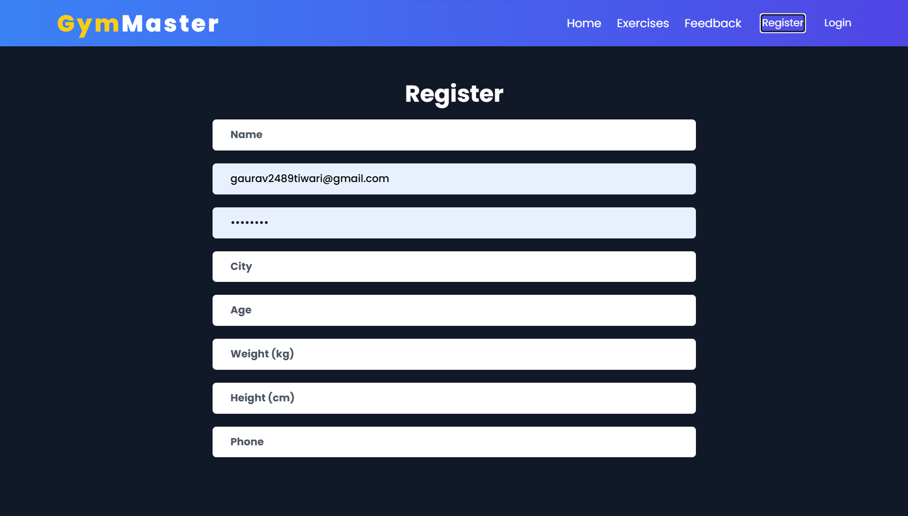
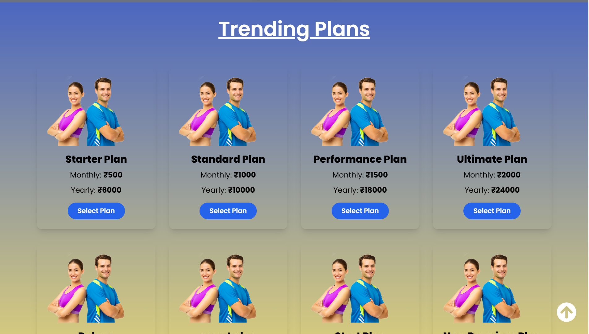
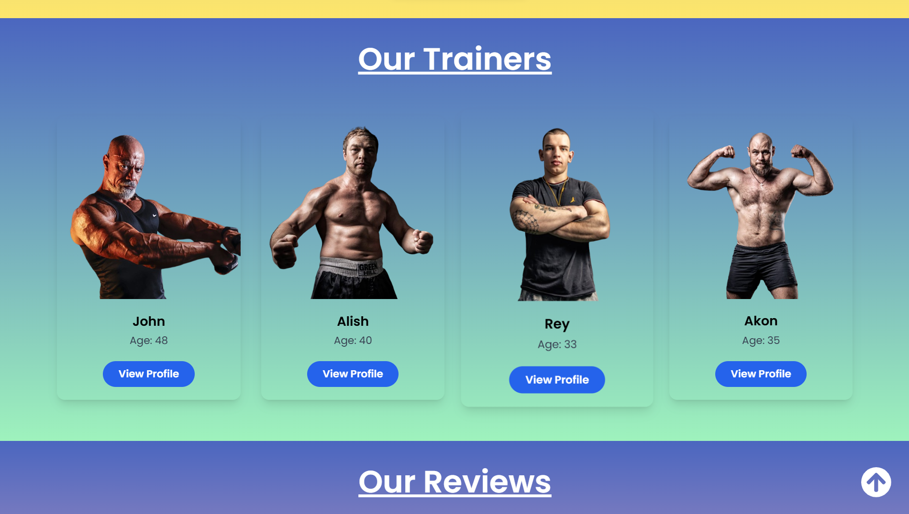
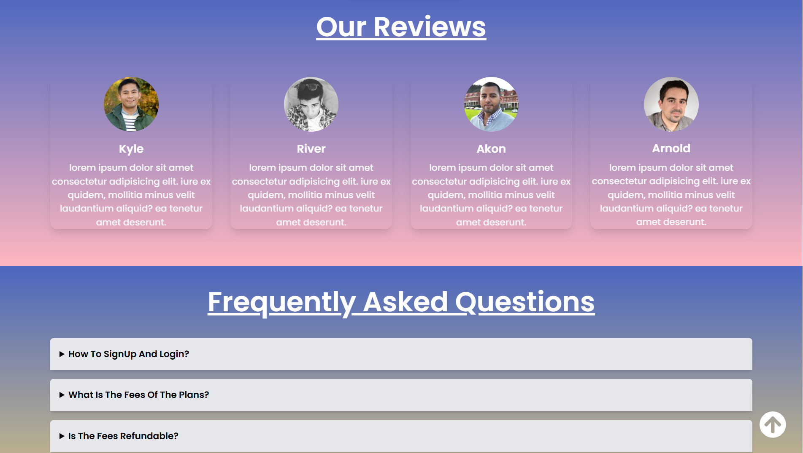
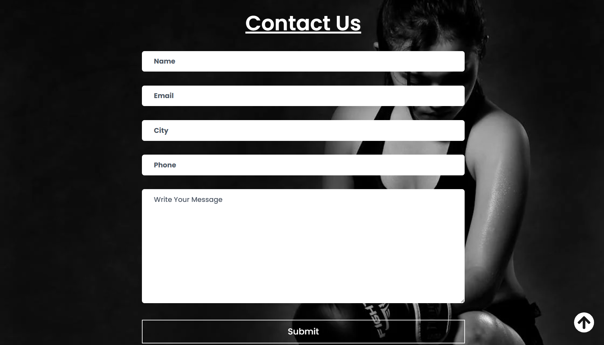
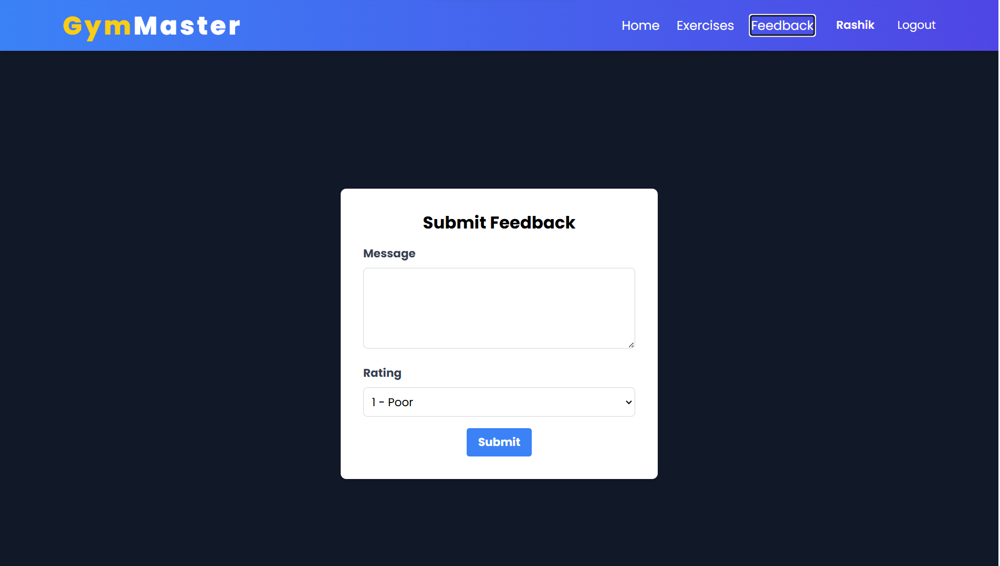
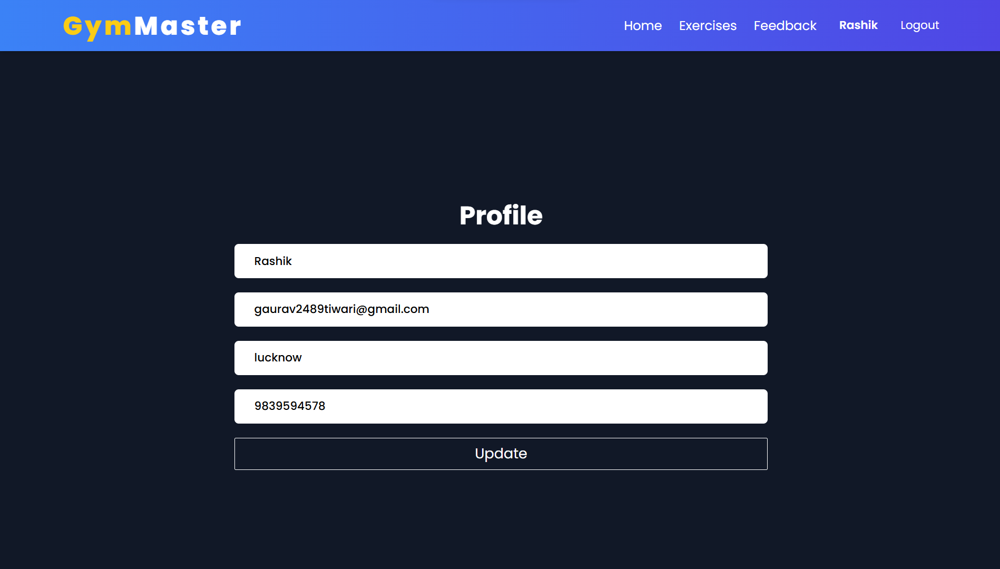

# 🏋️‍♂️ NutriGym – MERN Stack Fitness & Nutrition Management System

NutriGym is a full-stack **MERN Stack** web application that helps users manage their fitness journey by providing workout plans, trainer information, nutrition guidance, personalized fitness plans, and user profile management.

The application offers a clean, responsive, and user-friendly interface with secure authentication and MongoDB database integration.

---

## 🚀 Live Demo

> Add your deployed website link here

```
https://your-live-demo-link.vercel.app
```

---

## 🛠 Tech Stack

### Frontend
- React.js
- JavaScript (ES6+)
- Tailwind CSS
- Axios
- React Router DOM

### Backend
- Node.js
- Express.js
- MongoDB
- Mongoose

### Other Tools
- Git & GitHub
- VS Code
- Postman

---

## ✨ Features

- 🔐 User Registration & Login
- 🏋️ Workout Plans
- 🥗 Nutrition Guidance
- 👨‍🏫 Trainer Information
- 📅 Personalized Fitness Plans
- 📊 User Dashboard
- 👤 User Profile Management
- 💬 Feedback System
- 📞 Contact Form
- 📱 Fully Responsive Design
- 🌐 REST API Integration
- 💾 MongoDB Database Support

---

# 📸 Project Screenshots

## 🏠 Home Page



---

## 🔐 Login Page



---

## 📝 Register Page



---

## 💪 Workout Plans



---

## 👨‍🏫 Our Trainers



---

## ⭐ Reviews & Frequently Asked Questions



---

## 📞 Contact Us



---

## 💬 Feedback



---

## 📊 User Dashboard


---

## 🎯 Current User Plan


---

## 👤 User Profile



---

# 📂 Project Structure

```
NutriGym
│
├── client
│   ├── public
│   ├── src
│   ├── components
│   ├── pages
│   └── assets
│
├── server
│   ├── config
│   ├── controllers
│   ├── middleware
│   ├── models
│   ├── routes
│   └── server.js
│
├── images
├── README.md
└── package.json
```

---

# 📦 Installation

### Clone Repository

```bash
git clone https://github.com/GauravTiwari187/NutriGym.git
```

### Move into Project

```bash
cd NutriGym
```

---

## Install Frontend

```bash
cd client
npm install
npm run dev
```

---

## Install Backend

```bash
cd server
npm install
npm start
```

---

# ⚙ Environment Variables

Create a `.env` file inside the **server** folder.

```env
MONGO_URI=your_mongodb_connection_string

JWT_SECRET=your_secret_key

PORT=4000
```

---

# 📱 Responsive Design

✔ Desktop

✔ Tablet

✔ Mobile

---

# 🚀 Future Improvements

- Payment Gateway Integration
- Online Membership Purchase
- BMI Calculator
- Diet Recommendation System
- Admin Dashboard
- Progress Tracking
- Email Verification
- Password Reset
- Exercise Videos
- AI-based Fitness Recommendation

---

# 🤝 Contributing

Contributions are welcome.

1. Fork the repository
2. Create your feature branch

```bash
git checkout -b feature-name
```

3. Commit changes

```bash
git commit -m "Added new feature"
```

4. Push branch

```bash
git push origin feature-name
```

5. Open a Pull Request

---

# 👨‍💻 Author

**Gaurav Tiwari**

- 🎓 B.Tech Information Technology
- 💻 MERN Stack Developer
- 🌱 Currently Learning Data Structures & Algorithms

GitHub

https://github.com/GauravTiwari187

---

# ⭐ Show Your Support

If you like this project, please ⭐ star the repository.

It helps and motivates me to build more open-source projects.

---

## 📜 License

This project is licensed under the MIT License.